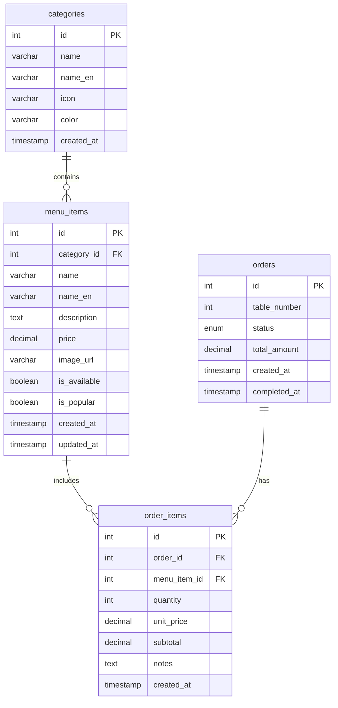

# 태블릿 주문 시스템 완성 보고서
## Tablet Ordering System - Walkthrough

프리미엄 레스토랑을 위한 태블릿 기반 주문 시스템을 성공적으로 구현했습니다.

---

## 📋 구현 완료 항목

### ✅ 핵심 기능
- **카테고리 선택**: 음료, 주류, 안주 3개 카테고리
- **메뉴 그리드**: 각 카테고리별 메뉴 아이템 표시
- **상세 모달**: 메뉴 클릭 시 상세 정보 팝업
- **장바구니**: 실시간 장바구니 관리 및 수량 조절
- **반응형 디자인**: 태블릿 화면에 최적화

### ✅ 디자인 시스템
- **다크 테마**: 레스토랑 분위기에 맞는 어두운 배경
- **그라데이션**: 카테고리별 고유 색상 그라데이션
- **글래스모피즘**: 반투명 효과와 블러 처리
- **부드러운 애니메이션**: 호버, 클릭, 전환 효과
- **프리미엄 타이포그래피**: Google Fonts (Outfit, Inter)

---

## 📁 파일 구조

### [index.html](file:///e:/TEST/index.html)
메인 HTML 파일로 다음을 포함:
- 헤더 (로고 + 장바구니 미리보기)
- 카테고리 선택 섹션
- 메뉴 그리드
- 상세 정보 모달

### [style.css](file:///e:/TEST/style.css)
완전한 디자인 시스템:
- CSS 변수로 정의된 색상 팔레트
- 카테고리별 그라데이션 (음료: 보라/파랑, 주류: 핑크/빨강, 안주: 파랑/청록)
- 반응형 그리드 레이아웃
- 애니메이션 및 전환 효과
- 모달 스타일링

### [app.js](file:///e:/TEST/app.js)
애플리케이션 로직:
- 메뉴 데이터 관리 (12개 샘플 아이템)
- 카테고리 필터링
- 모달 제어
- 장바구니 관리
- 알림 시스템

### [schema.sql](file:///e:/TEST/schema.sql)
데이터베이스 스키마:
- `categories` 테이블
- `menu_items` 테이블
- `orders` 테이블
- `order_items` 테이블
- 샘플 데이터 포함

---

## 🎨 생성된 메뉴 이미지

다음은 AI로 생성된 고품질 메뉴 이미지들입니다:

### 음료 카테고리


### 주류 카테고리


> [!NOTE]
> 나머지 메뉴 이미지(칵테일, 소주, 안주류)는 이미지 생성 할당량 제한으로 인해 Unsplash 플레이스홀더 URL을 사용했습니다. 실제 운영 시에는 실제 메뉴 사진으로 교체하시면 됩니다.

---

## 🗄️ 데이터베이스 구조

### 테이블 관계도



### 주요 특징
- **외래 키 제약**: 데이터 무결성 보장
- **인덱스**: 빠른 조회를 위한 최적화
- **샘플 데이터**: 테스트용 12개 메뉴 아이템
- **유용한 쿼리**: 주석으로 포함된 일반적인 SQL 쿼리

---

## 🎯 주요 기능 설명

### 1. 카테고리 선택
- 3개의 카테고리 카드 (음료, 주류, 안주)
- 클릭 시 해당 카테고리 메뉴 표시
- 활성 카테고리는 테두리와 그림자로 강조
- 호버 시 부드러운 상승 효과

### 2. 메뉴 그리드
- 반응형 그리드 레이아웃
- 각 메뉴 아이템 카드 포함:
  - 고품질 이미지
  - 메뉴 이름 (한글/영문)
  - 간단한 설명 (2줄 제한)
  - 가격
  - "인기" 배지 (해당 시)
  - "담기" 버튼

### 3. 상세 모달
메뉴 아이템 클릭 시 모달 팝업:
- 큰 이미지
- 카테고리 배지
- 전체 설명
- 가격
- 수량 조절 (+/- 버튼)
- "장바구니에 담기" 버튼

### 4. 장바구니
- 헤더의 장바구니 아이콘
- 실시간 아이템 개수 표시
- 총 금액 표시
- 클릭 시 장바구니 내용 확인 가능
- 알림 메시지로 추가 확인

---

## 💻 사용 방법

### 로컬에서 실행

1. **파일 열기**
   ```
   브라우저에서 e:\TEST\index.html 파일을 엽니다
   ```

2. **카테고리 선택**
   - 상단의 카테고리 카드를 클릭하여 메뉴 변경

3. **메뉴 추가**
   - **빠른 추가**: 메뉴 카드의 "담기" 버튼 클릭
   - **상세 보기**: 메뉴 카드 전체를 클릭하여 모달 열기

4. **장바구니 확인**
   - 헤더의 장바구니 아이콘 클릭

### 데이터베이스 설정

1. **MySQL/MariaDB에서 실행**
   ```bash
   mysql -u username -p database_name < schema.sql
   ```

2. **테이블 확인**
   ```sql
   SHOW TABLES;
   SELECT * FROM menu_items;
   ```

---

## 🎨 디자인 하이라이트

### 색상 팔레트
- **음료**: 보라-파랑 그라데이션 (#667eea → #764ba2)
- **주류**: 핑크-빨강 그라데이션 (#f093fb → #f5576c)
- **안주**: 파랑-청록 그라데이션 (#4facfe → #00f2fe)
- **배경**: 다크 그라데이션 (#0a0a0f → #13131a)

### 인터랙션
- **호버 효과**: 카드 상승, 그림자 증가
- **클릭 피드백**: 스케일 애니메이션
- **모달 전환**: 페이드 인 + 스케일 업
- **알림**: 슬라이드 인/아웃

### 타이포그래피
- **헤딩**: Outfit (모던하고 굵은 폰트)
- **본문**: Inter (읽기 쉬운 산세리프)

---

## 📱 반응형 디자인

- **태블릿 최적화**: 768px - 1024px
- **모바일 지원**: 768px 이하에서 단일 컬럼 레이아웃
- **터치 친화적**: 큰 버튼과 터치 영역

---

## 🚀 향후 개선 사항

> [!TIP]
> 다음 기능들을 추가하면 더욱 완성도 높은 시스템이 됩니다:

1. **백엔드 연동**
   - Node.js/Express 서버
   - MySQL 데이터베이스 연결
   - RESTful API 구현

2. **추가 기능**
   - 주문 제출 기능
   - 주문 내역 조회
   - 테이블 번호 설정
   - 직원 호출 버튼
   - 다국어 지원

3. **관리자 패널**
   - 메뉴 관리 (추가/수정/삭제)
   - 주문 현황 모니터링
   - 매출 통계

4. **결제 시스템**
   - 카드 결제 연동
   - 영수증 출력

---

## ✨ 완성된 파일 목록

- ✅ [index.html](file:///e:/TEST/index.html) - 메인 HTML 구조
- ✅ [style.css](file:///e:/TEST/style.css) - 완전한 디자인 시스템
- ✅ [app.js](file:///e:/TEST/app.js) - 애플리케이션 로직
- ✅ [schema.sql](file:///e:/TEST/schema.sql) - 데이터베이스 스키마
- ✅ 6개의 AI 생성 메뉴 이미지

---

## 🎉 결론

프리미엄 레스토랑을 위한 태블릿 주문 시스템이 성공적으로 구현되었습니다. 

**주요 성과:**
- ✨ 현대적이고 프리미엄한 디자인
- 🎨 카테고리별 고유한 색상 테마
- 📱 태블릿에 최적화된 반응형 레이아웃
- 🛒 완전한 장바구니 기능
- 🗄️ 확장 가능한 데이터베이스 구조
- 🖼️ 고품질 AI 생성 메뉴 이미지

브라우저에서 `index.html` 파일을 열어 바로 사용하실 수 있습니다!
